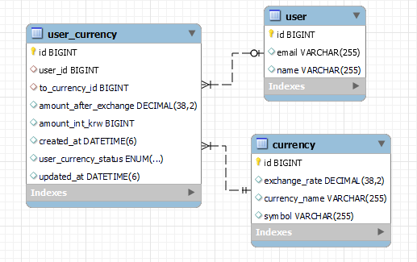

# Spring - Advanced

## 1. 학습 목표
- JPA 숙달
- 다양한 연관관계 맵핑
- 글로벌 예외처리
- PostConstruct 활용
- JPQL

## LV 0. API 명세서

### User (공통 요소 제외)
### Currency (공통 요소 제외)

### UserCurrency
| 기능                          | Method   | URL                                  | Request  | Response | 상태코드                                 |
|-----------------------------|----------|--------------------------------------|----------|----------|--------------------------------------|
| 일정 저장                       | `POST`   | /userCurrencies                      | 요청 body  | 등록 정보    | 201: 정상 등록, 400: 비정상 값, 404: 찾을 수 없음 |
| 특정 유저 환전 요청 조회              | `GET`    | /userCurrencies/users/{userId}       | 요청 param | 다건 응답 정보 | 200: 정상 조회, 404: 유저 찾을 수 없음          |
| 모든 유저의 환전 요청을 묶어서 count,sum | `GET`    | /userCurrencies/total                | 요청 param | 다건 응답 정보 | 200: 정상 조회, 404: 유저 찾을 수 없음          |
| 특정 유저의 환전 요청을 count, sum    | `PATCH`  | /userCurrencies/total/users/{userId} | 요청 param | 다건 응답 정보 | 200: 정상 조회                           |
| 선택 일정 삭제                    | `DELETE` | /userCurrencies/{userCurrencyId}     | 요청 param | 단건 응답 정보 | 204: 정상 삭제, 404: 환전 요청 찾을 수 없음       |
 
#### PostMan
https://www.postman.com/jo9999-2432/workspace/spring-advanced/collection/39356811-79a335f8-ba12-4b15-8581-9e09f3643bf8?action=share&creator=39356811

## ERD

